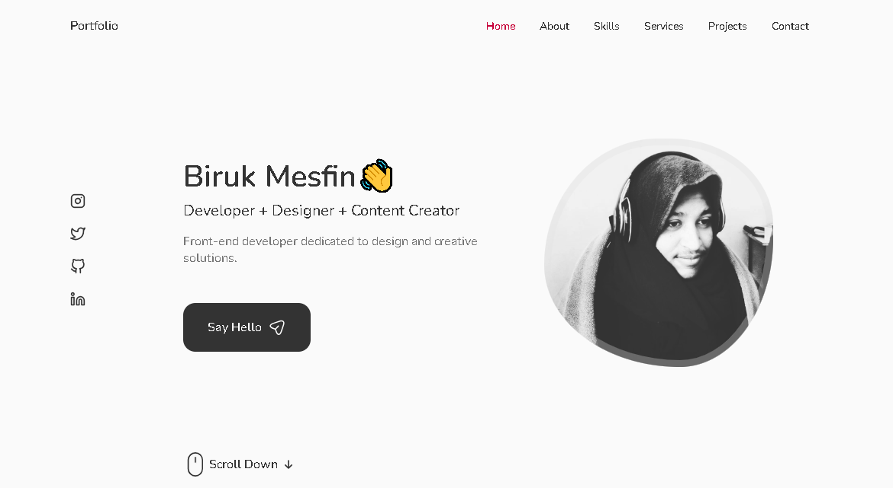

# Biruk Mesfin's Portfolio

Welcome to my portfolio website's GitHub repository! This repository hosts the code and assets for my personal portfolio website, showcasing my work, skills, and achievements.

## About Me

I'm Biruk Mesfin, a Software Engineer. I am passionate about [Relevant Interests or Specializations] and love to [Briefly describe what you love doing in your field].

## Portfolio Highlights

Explore some of the key features and sections of my portfolio:

- **Projects:** A collection of projects I've worked on, each with a brief description and link to the live project or repository.
- **Skills:** An overview of my technical skills and areas of expertise.
- **About:** A more detailed introduction about myself, my background, and my professional journey.
- **Contact:** Information on how to get in touch with me for collaborations, inquiries, or just to say hi!

## Visit My Portfolio

To explore my work and learn more about me, visit my portfolio website: [Portfolio Link](bkmn.me)

## Contributing

While this repository primarily hosts the code for my portfolio, I appreciate any feedback or suggestions you might have! If you find any issues or have ideas to enhance my portfolio, feel free to open an issue or submit a pull request.

## Contact Me

I'm always open to new connections and opportunities. Feel free to reach out to me:

- Email: [youremail@example.com](mailto:birukmesfin246@gmail.com)
- LinkedIn: [Your LinkedIn Profile](https://www.linkedin.com/in/biruk-mesfin/)
- Twitter: [@YourTwitterHandle](https://twitter.com/Bi2kmes)
- Instagram: [@YourInstagramHandle](https://instagram.com/biruk__m)

Thank you for visiting my portfolio repository. I hope you enjoy exploring my work!
